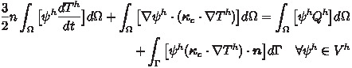

<div align="center">
  <a href="https://www.nektar.info/" target="_blank" >
    
  </a>
</div>
<div align="center">
  <a href="https://gitlab.nektar.info/neptune/nektar-diffusion/LICENSE.txt" target="_blank">
    
  </a>
</div>

<h1>Nektar-diffusion proxy-app</h1>

## Table of contents

  * [Description](#description)
  * [Installation and dependencies](#installation-and-dependencies)
    * [Installing Nektar++ from source](#installing-nektar++-from-source)
    * [Installing proxy-app](#installing-proxy-app)
  * [Execution](#execution)
  * [XML Session File](#xml-session-file)
  * [References](#references)
  * [License](#license)

## Description
**Nektar-diffusion proxy-app**: An anisotropic thermal conduction proxy-app for the magnetized plasma written in Nektar++ framework[(Cantwell et al 2015)](#cantwell-et-al-2015). The derivation of the anisotropic thermal conduction in the magnetized plasma and its variational formulation are documented in the [/docs/](https://gitlab.nektar.info/neptune/nektar-diffusion/-/tree/steady_b/docs) folder. For the detailed formulations and tutorials of Nektar++, please refer to the user-guide and developer-guide at the home page of [Nektar++](https://www.nektar.info/). Some examples are provided in the [example](https://gitlab.nektar.info/neptune/nektar-diffusion/-/tree/steady_b/example) folder. 

The variational formulation of the two-dimensional anisotropic thermal conduction in the magnetized plasma can be written as

<div align="center">
  <a href="https://gitlab.nektar.info/neptune/nektar-diffusion/-/tree/steady_b/docs" target="_blank" >
    
  </a>
</div>

latexmath:[C = \alpha + \beta Y^{\gamma} + \epsilon]

where \psi and $T$ respectively are the test function and the temperature. $\bm{\kappa}_c$ is the anisotropic thermal conductivity tensor and $Q$ represents the heat source in field. $\bm{n}$ is the outward normal vector along the boundaries of the domain.


## Installation and dependencies
The compilation of Nektar-diffusion proxy-app requires a C++ compiler, `CMake` and `Nektar++`. To successfully compile and install `Nektar++`, the following programs and libraries are also necessary: `Scotch`, `Boost`, `Flex`, `TinyXML` (for parsing parameters and setting up simulation), `Blas` and `Lapack` (for linear algebra). Some of these are required and must be installed prior to compiling `Nektar++`, most of which are available as pre-built system packages on most Linux distributions, installed manually by a user (typically the development packages with a *-dev* or *-devel* suffix is required) or can be downloaded and compiled by Nektar++ automatically (by specifying the flags of configuration), e.g., `TinyXML` and `Scotch`. It is important to make sure that the directory of their executables are included in the searching path of the system.

In addition, `Nektar++` can be installed with some optional packages in order to initiate a range of features: `OpenMPI` (for parallel computing), `HDF5` (for large-scale data storage and parallel input/outoput), `METIS` (for domain partitioning), `PETSc` (for extra solvers) and `FFTW` (for Fast Fourier Transforms). 

The typtical procedures of installation are presented below. It is recommended to use the pre-built packages, e.g., `OpenMPI`, in the system, especially compiling `Nektar++` on the cluster. It is assumed that the installation is done on a linux system or a cluster. For the additional information on the options of configuration and the full range of different features, please refer to the user-guide of [Nektar++](https://www.nektar.info/getting-started/documentation/).

### Installing Nektar++ from source
Clone the repository of `Nektar++` from [https://gitlab.nektar.info/nektar/nektar](https://gitlab.nektar.info/nektar/nektar) or download the tarball of `Nektar++` from [https://www.nektar.info/downloads/](https://www.nektar.info/downloads/) and put it into the home directory (**$HOME**). Assuming the name of the tarball is **nektar-5.0.2.tar.gz**, execute the following commands to install `Nektar++` into the default directory ($HOME/nektar-5.0.2/build/dist):

```bash
>tar -xvzf $HOME/nektar-5.0.2.tar.gz
>cd $HOME/nektar-5.0.2
>mkdir build && cd build 
>cmake -DNEKTAR_USE_MPI=ON -DNEKTAR_USE_SCOTCH=ON -DNEKTAR_USE_SYSTEM_BLAS_LAPACK=ON -DNEKTAR_USE_HDF5=ON -DTHIRDPARTY_BUILD_TINYXML=ON ..
>make -j 4 install
>ctest
```

The command *ctest* is used to run a series of testing cases to verify the correct installation.   

**Curses interface:** 

Alternatively, to specify the full range of flags of configuration using the curses interface to `CMake`, the following commands can be executed to install `Nektar++`:

```bash
>tar -xvzf $HOME/nektar-5.0.2.tar.gz
>cd $HOME/nektar-5.0.2
>mkdir build && cd build 
>ccmake ..
>make -j 4 install
>ctest
```
By executing the command *ccmake ..*, all flags of configuration are listed and displayed. For a typical installation, the following flags, NEKTAR_USE_MPI, NEKTAR_USE_SCOTCH, NEKTAR_USE_SYSTEM_BLAS_LAPACK and NEKTAR_USE_HDF5, should be switched on by pressing *enter* key. Subsequently, pressing *c* key until the option *Press [g] to generate and exit* appears. Finally, press *g* to generate the configuration file.  

**Debugging compilation, installation and testing:**

If the compilation fails, check the possible broken links during the configuration by the command *ccmake ..* and toggle the curses interface to the advanced mode by press the *t* key. A list of detailed links to the libraries will appear for investigation.

If an error was observed during installation, take note the description of this error and identify which program causes it. For example, if it is related to *mpi*, double check the possible broken links of mpi during configuration or verify the working condition of the pre-installed *mpi* on the cluster. In addition, the installed programs should be compatible with the version of `Nektar++`. The full list of the compatible versions of program can be found in the [user-guide](https://www.nektar.info/getting-started/documentation/).

If some testing cases fail during *ctest*, check the log files in the **$HOME/nektar-v5.0.2/build/Testing/Temporary/** folder and identify the origin of the error.

### Installing proxy-app
Clone the repository of Nektar-diffusion proxy-app from [https://gitlab.nektar.info/neptune/nektar-diffusion](https://gitlab.nektar.info/neptune/nektar-diffusion) and put it into the home directory (**$HOME**). Assuming the name of the cloned repository is **nektar-diffusion**, execute the following commands to install the Nektar-diffusion proxy-app into the default directory ($HOME/nektar-diffusion/build/dist):

```bash
>cd $HOME/nektar-diffusion
>mkdir build && cd build 
>cmake -DNektar++_DIR=$HOME/nektar-v5.0.2/build  ..
>make -j 4 install
```

*DNektar++_DIR* should be the directory containing either *Nektar++Config.cmake* or *nektar++-config.cmake*. In this case, it is *$HOME/nektar-v5.0.2/build*.

**Curses interface:** 

Alternatively, the proxy-app can be installed using the curses interface to `CMake`:

```bash
>cd $HOME/nektar-diffusion
>mkdir build && cd build 
>ccmake  ..
>make -j 4 install
```

While configuring the proxy-app with *ccmake ..*, define *Nektar++_DIR=~/nektar-v5.0.2/build*, press *c* key and press *g* key to generate the configuration file.

## Execution
In the provided examples, the mesh is prepared using [gmsh](https://gmsh.info/). It can be installed by

```bash
>cd $HOME
>wget https://gmsh.info/bin/Linux/gmsh-2.16.0-Linux64.tgz
>tar -xvzf gmsh-2.16.0-Linux64.tgz
>cd gmsh-2.16.0-Linux
>echo 'PATH=$HOME/gmsh-2.16.0-Linux/bin:$PATH' >> $HOME/.bashrc
>source $HOME/.bashrc
```

 To run the examples provided in the [example](https://gitlab.nektar.info/neptune/nektar-diffusion/-/tree/steady_b/example) folder, access the folder containing a particular example and execute the following command:

1. **convert mesh**

```bash
>gmsh -2 -order 1 domain.geo
>$HOME/nektar-v5.0.2/build/dist/bin/NekMesh domain.msh domain.xml
```

2. **execute simulation**

```bash
>mpirun -np 4 $HOME/nektar-diffusion/build/dist/DiffusionSolver domain.xml conditions.xml
```

3. **post-processing**

```bash
>$HOME/nektar-v5.0.2/build/dist/bin/FieldConvert domain.xml domain.fld domain.dat
```
The output file format is in *.dat* (tecplot file). To view the results in paraview, change *.dat* to *.vtu*.

## XML Session File
The XML session file is used as an input file to communicate with the Nektar++ libraries and set up the simulations. It starts with the **\<NEKTAR> ... \</NEKTAR>** section and include a number of sub-sections. For example,

```
<NEKTAR>
  <GEOMETRY>
  ...
  </GEOMETRY>
  <EXPANSIONS>
  ...
  </EXPANSIONS>
  <CONDITIONS>
    <PARAMETERS>
    ...
    </PARAMETERS>
    <SOLVERINFO>
    ...
    </SOLVERINFO>
    <VARIABLES>
    ...
    </VARIABLES>
    <BOUNDARYREGIONS>
    ...
    </BOUNDARYREGIONS>
    <BOUNDARYCONDITIONS>
    ...
    </BOUNDARYCONDITIONS>
  </CONDITIONS>
</NEKTAR>
```

The **\<GEOMETRY> ... \</GEOMETRY>** section stores the information on the mesh, e.g., the vertex, edge, face and element lists. The **\<EXPANSIONS> ... \</EXPANSIONS>** section defines the employed approximating function. Especially, *NUMMODES* defines the order of the approximating function. 

The **\<CONDITIONS> ... \</CONDITIONS>** section contains the information to set up the parameters of the numerical algorithms. For instance, the **\<PARAMETERS> ... \</PARAMETERS>** section defines the parameters used in the simulations, the **\<SOLVERINFO> ... \</SOLVERINFO>** section controls the paramters of the employed solver and the **\<VARIABLES> ... \</VARIABLES>** section lists out the physical variables that the simulation solves for. The **\<BOUNDARYREGIONS> ... \</BOUNDARYREGIONS>** and the **\<BOUNDARYCONDITIONS> ... \</BOUNDARYCONDITIONS>** describe where and what boundary conditions are imposed. 

For the detailed explanation and examples of XML Session files in `Nektar++`, please refer to its [user-guide](https://www.nektar.info/getting-started/documentation/) and [tutorials](https://www.nektar.info/getting-started/tutorials/) respectively.


## References

#### (Cantwell et al 2015) 
*Nektar++: An open-source spectral/hp
element framework.* [[DOI](https://doi.org/10.1016/j.cpc.2015.02.008)]

## License

See the [LICENSE](LICENSE.txt) file for license rights and limitations (MIT).

